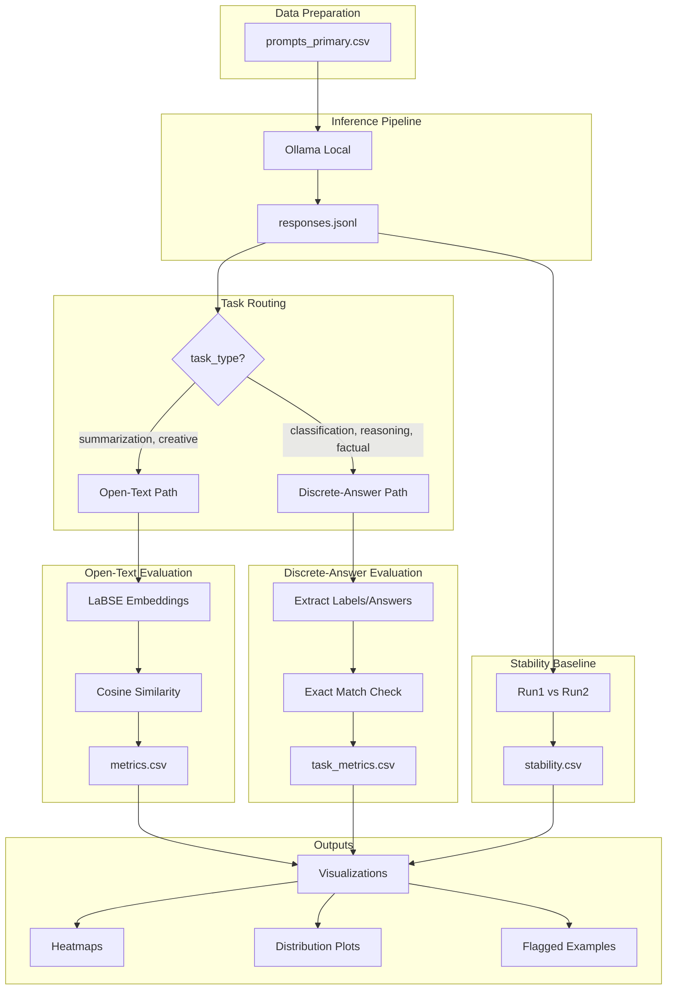

# Cross-Lingual Prompt Consistency Evaluation Framework

## Overview

This plan implements the evaluation pipeline described in the PRD to measure how consistently LLMs respond to semantically equivalent prompts across English (EN), German (DE), and Turkish (TR). The framework uses:

- **Ollama** for local inference with `gemma3:1b` and `llama3.2:1b`
- **LaBSE embeddings** for semantic similarity on open-text tasks (summarization, creative)
- **Exact/normalized match** for discrete-answer tasks (classification, reasoning, factual)

---

## Architecture



---

## Implementation Steps

### 1. Repository Structure Setup

Create the directory structure and configuration files:

```
crosslingual-consistency/
├── configs/
│   ├── models.yaml          # Model IDs + decoding params
│   └── embeddings.yaml      # LaBSE configuration
├── data/
│   └── prompts_primary.csv  # 20 prompts x 3 languages
├── src/
│   ├── __init__.py
│   ├── load_prompts.py      # CSV loader
│   ├── infer_ollama.py      # Ollama inference client
│   ├── embed_labse.py       # LaBSE embedding
│   ├── similarity.py        # Cosine + aggregation
│   ├── task_checks.py       # Discrete-answer checks
│   └── plots.py             # Visualization
├── notebooks/
│   ├── 01_collect_responses.ipynb
│   ├── 02_metrics_and_plots.ipynb
│   └── 03_qualitative_review.ipynb
├── outputs/
│   ├── plots/
│   └── reports/
├── requirements.txt
└── README.md
```

### 2. Configuration Files

**`configs/models.yaml`** - Define model parameters:

- Models: `gemma3:1b`, `llama3.2:1b`
- temperature: 0.3
- num_predict: 256 (Ollama's max_new_tokens equivalent)
- runs_per_prompt: 2

**`configs/embeddings.yaml`** - LaBSE settings:

- model_name: `sentence-transformers/LaBSE`

### 3. Data Preparation (`data/prompts_primary.csv`)

Generate CSV from Appendix A with schema:

- `prompt_id` (1-20)
- `task_type` (summarization | classification | reasoning | factual | creative)
- `language` (EN | DE | TR)
- `text` (full prompt with language-specific control line prepended)

Control lines to prepend:

- EN: `Respond in English. Follow the output format exactly. Do not add explanations.`
- DE: `Antworte auf Deutsch. Halte dich exakt an das Ausgabeformat. Keine Erklarungen.`
- TR: `Turkce yanit ver. Cikti formatina tam uy. Aciklama ekleme.`

### 4. Source Modules

**`src/load_prompts.py`**

- Load prompts from CSV
- Filter by task_type, language, or prompt_id
- Return as list of dictionaries

**`src/infer_ollama.py`**

- Connect to local Ollama instance
- Generate responses with fixed params (temp=0.3, num_predict=256)
- Track run_id, timestamp, model_id
- Detect and flag non-compliant outputs
- Append results to `responses.jsonl`

**`src/embed_labse.py`**

- Load LaBSE model from sentence-transformers
- Embed response texts into dense vectors
- Cache embeddings for reuse

**`src/similarity.py`**

- Compute cosine similarity between embedding pairs
- Aggregate by language pair (EN-DE, EN-TR, DE-TR)
- Aggregate by task type
- Flag bottom 10% as low similarity
- Compare cross-lingual vs intra-language stability

**`src/task_checks.py`**

- Extract labels/answers from discrete-answer responses:
  - Classification: Positive/Negative, Agree/Disagree, Request/Complaint, Formal/Informal
  - Reasoning: A/B/C, numeric values with units
  - Factual: formula, year, city name, author name
- Compare across languages (same run_id)
- Compare run1 vs run2 within language
- Output match/mismatch/uncertain results

**`src/plots.py`**

- Heatmap: rows = prompt_id, columns = language pairs, values = cosine similarity
- Distribution: boxplot/density per language pair
- Summary table: mean/std by pair and task type
- Stability comparison chart

### 5. Notebooks

**`notebooks/01_collect_responses.ipynb`**

- Load prompts
- Run inference for all prompts x languages x runs x models
- Save to `data/responses.jsonl`

**`notebooks/02_metrics_and_plots.ipynb`**

- Load responses
- Route by task_type
- Compute LaBSE embeddings and cosine similarity (open-text)
- Run task-aware checks (discrete-answer)
- Compute stability baseline
- Generate and save all plots/tables

**`notebooks/03_qualitative_review.ipynb`**

- Load flagged low-consistency examples
- Display prompt, responses in all languages
- Manual annotation interface for drift type

### 6. Output Files

| File | Content |

|------|---------|

| `data/responses.jsonl` | All LLM responses with metadata |

| `data/metrics.csv` | Cross-lingual cosine for open-text tasks |

| `data/stability.csv` | Intra-language run1 vs run2 stability |

| `data/task_metrics.csv` | Discrete-answer match results |

| `outputs/plots/` | Heatmaps, distribution plots |

| `outputs/reports/` | Summary tables, flagged examples |

---

## Dependencies (`requirements.txt`)

```
ollama
sentence-transformers
pandas
numpy
matplotlib
seaborn
scikit-learn
jupyter
pyyaml
```

---

## Key Implementation Notes

1. **Request Volume**: 20 prompts x 3 languages x 2 runs x 2 models = 240 inference calls
2. **Run Pairing**: Cross-lingual comparisons use same `run_id` (run1-to-run1, run2-to-run2)
3. **Stability Baseline**: Measures model randomness via run1 vs run2 within each language
4. **Non-compliance Handling**: Flag outputs that violate format constraints; optionally retry once
5. **Caching**: `responses.jsonl` is the canonical cache; treat as immutable once generated