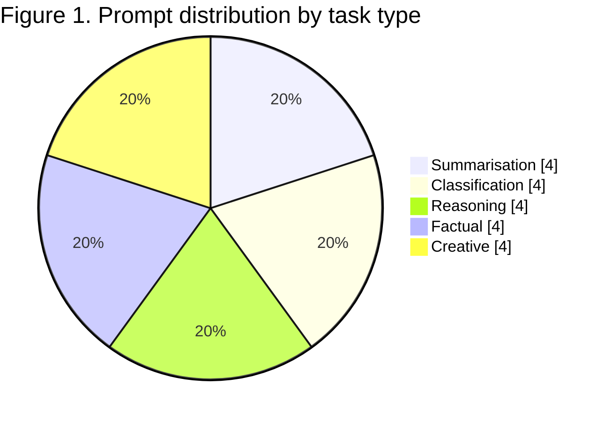
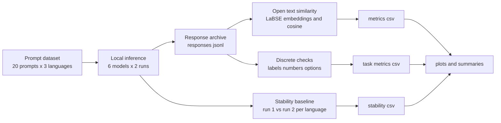
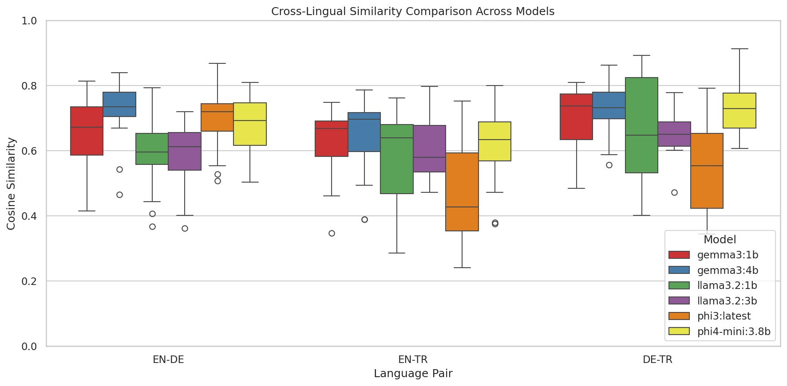
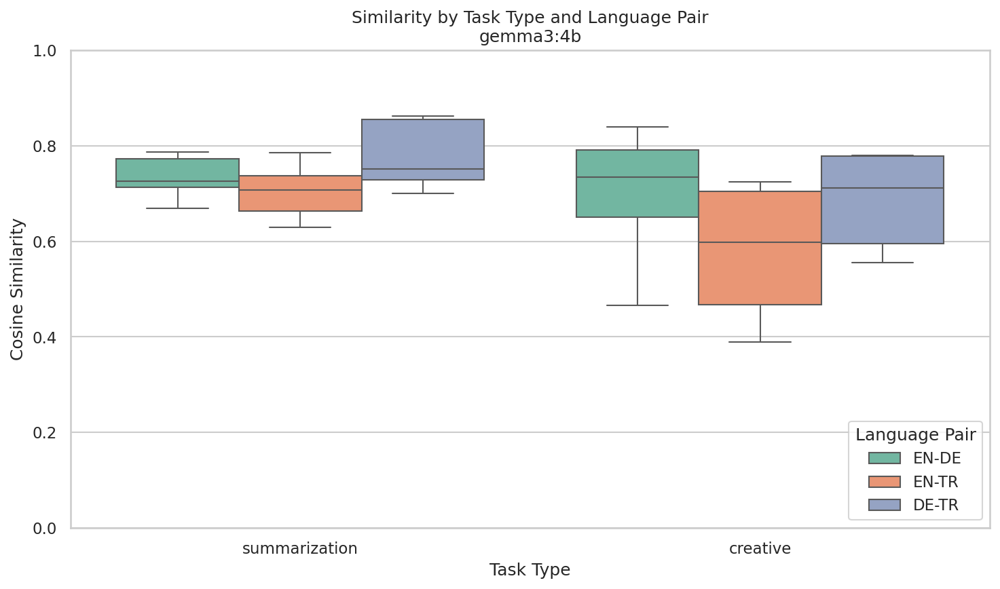
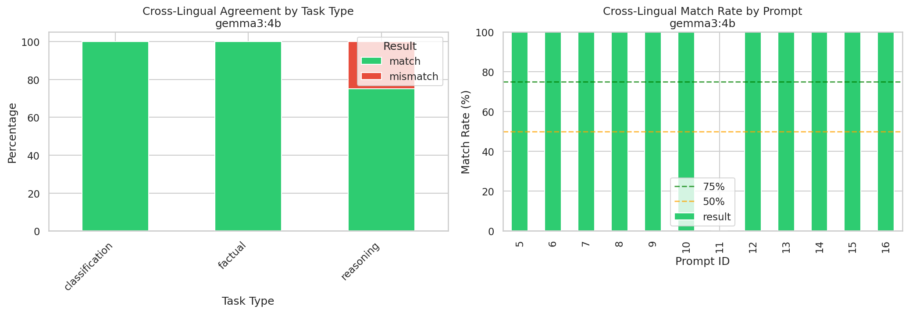
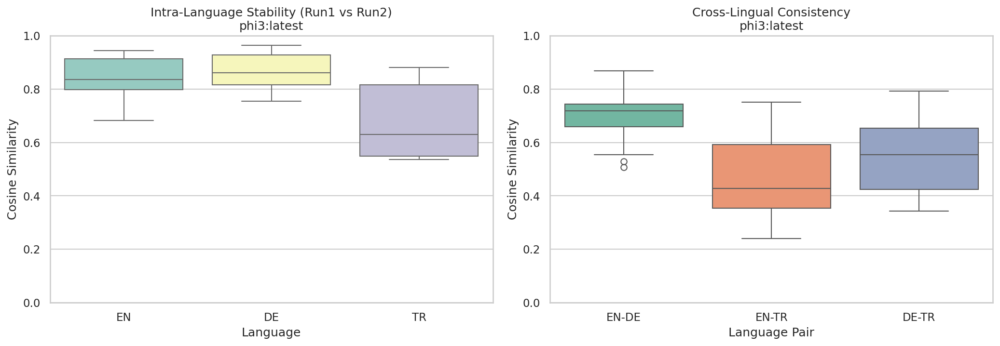
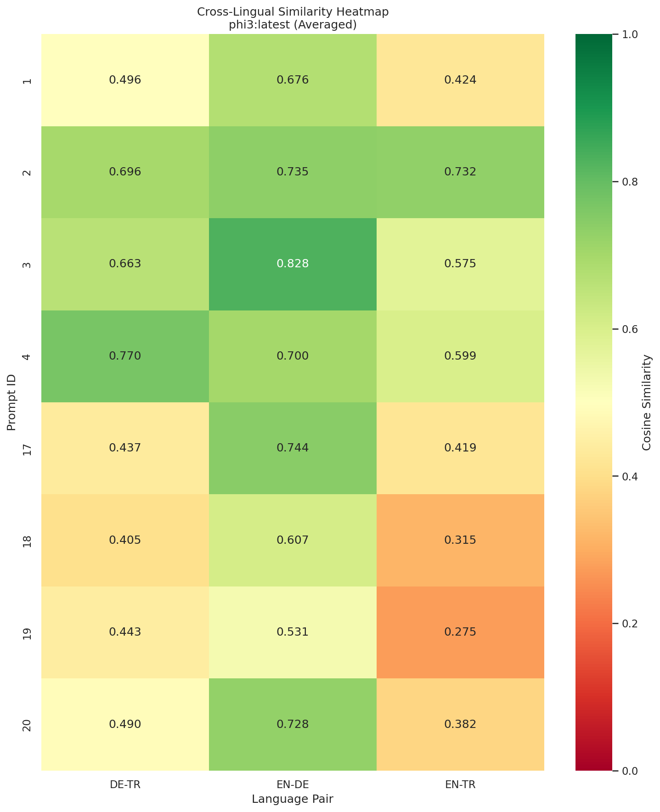

## Evaluating Cross-Lingual Prompt Consistency in Large Language Models

### Abstract

This study evaluates cross lingual consistency in small locally deployed language models. It focuses on English German and Turkish prompts that carry equivalent meaning. The work tests whether models preserve meaning and discrete answers across languages. The study uses local inference with identical decoding settings for all models. It measures semantic similarity using multilingual sentence embeddings and it checks agreement for discrete tasks. The dataset contains 20 prompts across five task types and the study generates 720 total responses. Results show a clear gap between language pairs and a strong task effect.

### Introduction

Cross lingual capabilities have moved from a specialised feature to a baseline expectation for many digital systems. Customer support assistants product search tools education platforms and internal enterprise copilots increasingly interact with users who mix languages or who require content in multiple languages. In these settings a system is not judged only by whether it can produce fluent text in each language. It is judged by whether it can preserve the same intent handle the same constraints and deliver functionally equivalent answers across languages.

Cross lingual consistency matters for three operational reasons. First, inconsistent behaviour creates fairness and access risks. Second, inconsistency undermines trust, because multilingual users can compare answers across languages and detect contradictions. Third, inconsistency complicates product engineering, because downstream systems often assume that the response to the same logical prompt is comparable across languages.

At the same time, perfect equivalence is not always realistic. Languages differ in grammar idiom and pragmatic norms. A brief English slogan may require more words in Turkish. A summarisation may preserve meaning while selecting different details due to differences in what seems salient. Therefore the key problem is not to eliminate all variation. The key problem is to measure variation and identify when variation crosses a boundary into drift that changes meaning breaks requested format or flips discrete answers.

This essay synthesises an empirical evaluation of cross lingual prompt consistency for six locally run models. It compares English German and Turkish responses across five task types. It measures open text similarity with multilingual embeddings and discrete agreement with task-aware extraction, and it reports run to run stability within each language.

The essay grounds its claims in concrete artefacts produced by the project. The primary narrative and qualitative coding come from `docs/REPORT_FINAL.md`. Quantitative results are derived from the metric tables in `data/metrics.csv`, `data/task_metrics.csv`, and `data/stability.csv`. Figures are drawn from `outputs/plots/`. The results are reported separately from discussion.

### Background and related research

Multilingual evaluation has two recurring themes that motivate this work. The first theme is that translation changes the input distribution even when the intended meaning stays constant. Languages vary in morphology and word order, which can shift the cues a model uses for instruction following. These differences can affect whether a model identifies the task type correctly and whether it follows the requested output style.

The second theme is that multilingual outputs can vary along multiple dimensions that are not equivalent in severity. A response can preserve meaning but change style, such as producing a longer explanation in one language. A response can preserve format but change semantics, such as selecting a different claim or conclusion. A response can preserve meaning but violate a format requirement, such as returning a paragraph instead of a label. Therefore a robust evaluation must separate semantic differences from format differences and must treat discrete answer tasks differently from open text tasks.

Recent multilingual evaluation work also argues that language effects can be confounded with cultural context. Ying et al. (2025, p. 22230) propose a dual evaluation perspective by “decomposing the evaluation along the dimensions of linguistic medium and cultural context.” For cross lingual consistency work, this matters because a language pair gap can reflect not only linguistic distance but also differences in culturally grounded assumptions embedded in prompts and expected answers. Future work could extend our prompt set by varying cultural framing independently from language to separate cultural effects from linguistic drift.

At the representation level, Lim, Aji, and Cohn (2025, p. 1) provide a mechanistic account of why multilingual inconsistency can emerge: “LLMs predict inconsistently and are less accurate because they rely on representations that are dissimilar across languages, rather than working in a shared semantic space.” This claim motivates the use of language agnostic semantic similarity measures in the present study. If models fail to converge onto shared representations, then cross language prompts can trigger different internal pathways even when the intended meaning is constant.

At the evaluation design level, multilingual surveys emphasise that measurement choices shape what conclusions are defensible. Zhu et al. (2024, p. 1) note that “An important focus of this survey is on the evaluation of MLLMs,” and they catalogue how multilingual capability spans knowledge, reasoning, safety, and interpretability. In other words, multilingual capability is not a single axis, and an evaluation that only reports one aggregate score risks collapsing distinct failure modes into one number.

Alignment centered surveys also highlight that multilingual behavior depends on how models are aligned, not only on how they are pre-trained. Qin et al. (2025, p. 1) describe work “introducing a systematic taxonomy based on alignment strategies,” which clarifies that different alignment routes can produce different cross lingual behaviors. In response, the present study combines embedding based similarity for open text tasks with task aware extraction for discrete tasks, and it reports a stability baseline to separate language effects from sampling variability.

The study also introduces a qualitative drift taxonomy as a bridge between metrics and actionable debugging. The taxonomy used in the report distinguishes semantic drift format drift factual drift style drift and hallucination. In this taxonomy, semantic drift refers to changes in core meaning that undermine equivalence. Format drift refers to changes in structure or requested output shape. Factual drift refers to changes in discrete truth claims or labels. Style drift refers to changes in tone or verbosity that may be acceptable in isolation but often correlate with inconsistent compliance. Hallucination refers to fabricated or irrelevant content that appears in one language but not another.

Recent multilingual prompt engineering work further motivates this combination of format controls and semantic evaluation. Huszár (2024, p. 5) describes multilingual prompt engineering for instruction transfer as “a promising avenue for extending the adaptability of large language models (LLMs) beyond the confines of the primary predominant English.” In his thesis on sentiment analysis, Huszár evaluates monolingual and cross-lingual prompt templates and reports that demonstrations plus iterative rephrasing can improve instruction generation quality across languages (Huszár, 2024).

The motivation for focusing on small local models is practical. Small local models often exhibit sharper trade offs between language coverage and reasoning capability.

### Research gap and research questions

Many evaluations report multilingual benchmark scores but do not explicitly measure whether the same prompt expressed in different languages produces equivalent outputs. In addition, many studies do not compare cross lingual divergence to within language stability, which makes it difficult to attribute differences to language rather than sampling. This project targets that gap by evaluating a controlled prompt set in three languages with repeated runs and by measuring both cross lingual similarity and within language stability.

Related benchmark work also highlights how linguistic scope can limit what multilingual evaluation reveals. In the context of code generation, Raihan et al. (2025, p. 11432) note, “To address this gap, we introduce mHumanEval, an extended benchmark supporting prompts in over 200 natural languages.” This motivates reporting results with explicit language scope. Compared with breadth-first benchmarks like mHumanEval, our study trades language coverage for repeated runs, task-aware checks, and qualitative drift evidence on a smaller, controlled prompt set.

The study evaluates four research questions.

- **RQ1** How does cross lingual semantic similarity vary across task types.
- **RQ2** Do models maintain consistent discrete answers across languages for classification reasoning and factual tasks.
- **RQ3** Which language pairs show the largest consistency gaps.
- **RQ4** How does cross lingual consistency compare to within language stability.

### Study design and dataset

The dataset contains 20 prompts organised into five task types with four prompts per type. The task types are summarisation classification reasoning factual and creative generation. Each prompt is translated into three languages English German and Turkish. The dataset therefore contains 60 prompt instances defined by the product of prompt identity and language.

The design intentionally balances tasks and languages. This reduces confounding by prompt frequency and allows the analysis to compare task categories under the same sampling effort. The dataset covers both open ended generation and constrained answer formats. Summarisation prompts require a one sentence compression of a paragraph. Creative prompts include slogans ad copy and short advice. Classification prompts require labels such as sentiment intent formality and agreement. Reasoning prompts include multiple choice logic and numeric calculation. Factual prompts ask for short factual answers.

The inference protocol evaluates six local models. The model set includes `gemma3:1b`, `gemma3:4b`, `llama3.2:1b`, `llama3.2:3b`, `phi3:latest`, and `phi4-mini:3.8b`. Each prompt instance is run twice per model under identical decoding settings to measure stability. This yields 720 total responses computed as 20 prompts times three languages times two runs times six models.

A compact representation of dataset composition is given in Figure 1, which shows the balanced distribution of prompts across task types.

The dataset and results are stored in reproducible formats. `data/prompts_primary.csv` stores the prompt texts. `data/responses.jsonl` stores raw model outputs for each model language run and prompt. `data/metrics.csv` stores open text cosine similarity by model prompt language pair and run. `data/task_metrics.csv` stores discrete task extraction keys and match results. `data/stability.csv` stores within language stability values between run one and run two.

### Workflow and experimental settings

The evaluation pipeline follows a fixed sequence from inference to analysis. Figure 2 presents the workflow at a high level.

The implementation uses local inference and Python based analysis. Model selection and inference settings are configured through YAML files under `configs/`. The decoding configuration used in the study includes temperature 0.3 and a maximum generation length of 256 tokens. The protocol uses two runs per prompt to estimate within language stability.

A practical aspect of the workflow is data quality control. The study encountered issues typical of evaluation pipelines. Prompt storage required robust CSV quoting due to nested quotes and non ASCII punctuation. Response collection required non compliance checks to ensure that discrete tasks produced extractable labels or numbers. The non compliance logic was refined to avoid conflating correctness with format compliance. These engineering details matter because they influence whether the evaluation measures model behaviour or pipeline artefacts.

### Data preparation and response quality controls

Any multilingual evaluation depends on whether its artefacts are machine readable and consistently labelled. A single quoting or parsing issue can corrupt inputs and lead to misleading conclusions about model performance. For this reason the project treated data preparation and response quality controls as part of the research design rather than as incidental engineering.

At the input stage, the prompt dataset contains punctuation patterns that commonly break naive CSV ingestion. German prompts can include nested quotation marks and non ASCII quote characters, and Turkish prompts can include apostrophes and suffix patterns that interact with tokenisation. The prompt table was therefore stored using robust quoting so that downstream loaders could parse it deterministically. This ensured that the dataset remained stable across runs and that each model received the intended text in each language.

At the output stage, the main goal was to ensure that generated responses could be evaluated consistently. Open text responses are evaluated with embeddings, so minor formatting differences rarely block the pipeline. Discrete tasks are different. A classification response might include both a label and an explanation. A reasoning response might mention multiple numbers. A factual response might include the answer plus commentary. If the evaluation expects a strict label only, these outputs would be treated as non compliant even when the required key exists. If the evaluation accepts any text that contains the key, it can mistakenly accept outputs that include multiple conflicting keys.

The project therefore used task aware extraction and a compliance definition focused on format rather than correctness. Compliance checks were designed to answer a narrow question. Did the response contain an extractable label number or option that corresponded to the expected answer schema for that prompt. Correctness was then evaluated separately through agreement metrics or through semantic similarity, rather than being treated as a formatting failure.

This format oriented view is consistent with recent work on rule adherence in long and complex contexts. Wang et al. (2025, p. 1) propose MLPrompt, which “automatically translates the error-prone rule that an LLM struggles to follow into another language, thus drawing greater attention to it.”

Our retry and overwrite step for non compliant cases follows the same attention focusing goal, even though we do not explicitly translate rules across languages.

The project also refined the compliance logic to avoid language bias. Early versions of checks were English centric and failed when valid German and Turkish labels appeared. Later versions expanded valid label sets to cover common variants across languages and relaxed positional assumptions so that a valid label could appear anywhere in the response. This reduced false positives where a model was compliant but verbose. It also ensured that compliance statistics reflected genuine inability to follow instructions, not the evaluator’s limited label vocabulary.

An additional quality control concerns model level inference failures. During development, one model produced a high rate of empty outputs under the local inference stack. Empty outputs are not informative for cross lingual consistency because they reflect infrastructure or model runtime issues rather than language understanding. The final evaluation therefore removed that model and removed its associated data so that the dataset reflects meaningful responses.

Finally, the project used targeted response regeneration only as a development tool. When a response was flagged as non compliant under a strict rule, the pipeline could ask the same model to regenerate with a stricter instruction that emphasised the required schema. Regeneration occurred with the same model that produced the original output, which preserves the goal of evaluating each model’s behaviour rather than substituting a stronger model. The final dataset achieves near complete compliance while maintaining model specific attribution for remaining failures.

### Reproducibility and transparency

The study was designed so that results can be re computed from stored artefacts without rerunning inference. Raw responses are stored in `data/responses.jsonl`, which serves as a canonical archive for all later steps. The metric tables in `data/metrics.csv`, `data/task_metrics.csv`, and `data/stability.csv` provide machine readable summaries that can be audited and recomputed. Each row records model identity prompt identity task type language pair or language run identity and the measured value.

The configuration directory `configs/` stores key settings, including the list of models and inference parameters. This makes the experimental settings explicit and reduces ambiguity when replicating the evaluation. The plots in `outputs/plots/` provide an interpretable view of the same numbers and make it easier to detect anomalies, such as a model that performs well on EN DE but collapses on Turkish pairs. Per model summaries in `outputs/reports/` provide additional cross checks that aggregate the underlying CSV rows.

This transparency supports a common review workflow. A reader can start from a claim in a plot, validate the plotted value against a table, and then trace the value back to specific prompt instances in the raw response archive. In this sense, the artefacts form an audit trail that connects qualitative impressions to quantitative measurements.

### Measures and operational definitions

The study uses three primary measurement families.

- **Open text cross lingual semantic similarity** For summarisation and creative tasks, responses are embedded using LaBSE sentence embeddings (Feng et al., 2020) and similarity is computed as cosine similarity between embeddings. The analysis compares pairs EN DE EN TR and DE TR per run.

- **Discrete answer agreement** For classification reasoning and factual tasks, the analysis extracts a task specific key from each language response. For classification the key is the label. For multiple choice reasoning the key is the option letter. For numeric reasoning the key is the extracted number. For factual tasks the key is the answer string or normalised entity. The metric is match versus mismatch across the three languages.

- **Within language stability** Stability is measured by comparing run one and run two within the same language for the same prompt and model. For open text tasks stability uses cosine similarity between run one and run two embeddings. For discrete tasks stability uses exact match of extracted keys.

In addition to these numeric metrics, the study provides a qualitative drift taxonomy. The taxonomy supports explanation of why similarity drops occur and helps connect aggregate patterns to specific failure modes that matter for deployment.

### Evidence artefacts and key figures

The project produces a set of plots that visualise the most important trends. The most critical plots for the research questions are included as figures.

Figure 3 provides an overall comparison of model level cross lingual similarity.

Figure 4 illustrates how task type affects similarity for a representative model.

Figure 5 summarises discrete answer match rates for the top performing model.

Figure 6 shows the stability profile for a model with notable Turkish instability.

Figure 7 provides a heatmap view of cross lingual similarity for a model with strong EN DE performance but weak Turkish performance.

### Empirical findings

This section reports results without interpretation. It follows the rule that each paragraph answers one research question and avoids explanatory claims.

#### Findings for RQ1

Table 1 reports mean cosine similarity for open text tasks by task type, computed from `data/metrics.csv` across all models language pairs and runs. Summarisation has a mean similarity of 0.7029. Creative generation has a mean similarity of 0.5716. Across all open text comparisons, the cosine similarity distribution has mean 0.6373 and standard deviation 0.1316.

| Table 1. Mean open text similarity by task type | Mean cosine similarity |
|---|---:|
| Summarisation | 0.7029 |
| Creative | 0.5716 |

Table 2 reports mean cosine similarity by model, computed from `data/metrics.csv`.

| Table 2. Mean open text similarity by model | Mean cosine similarity |
|---|---:|
| gemma3:4b | 0.6969 |
| phi4-mini:3.8b | 0.6740 |
| gemma3:1b | 0.6613 |
| llama3.2:3b | 0.6172 |
| llama3.2:1b | 0.6046 |
| phi3:latest | 0.5696 |

Table 2b reports distribution quantiles for cosine similarity across all open text comparisons in `data/metrics.csv`.

| Table 2b. Open text cosine similarity quantiles | Cosine similarity |
|---|---:|
| 0.05 | 0.3824 |
| 0.25 | 0.5563 |
| 0.50 | 0.6587 |
| 0.75 | 0.7332 |
| 0.95 | 0.8102 |

#### Findings for RQ2

Table 3 reports match rates for discrete tasks from `data/task_metrics.csv`. The overall discrete match rate across models and tasks is 0.6458. For classification, match rates range from 0.1250 to 1.0000. For reasoning, match rates range from 0.1250 to 0.7500. For factual tasks, five models have match rate 1.0000 and one model has match rate 0.7500.

| Table 3. Discrete match rate by model and task type | Classification | Reasoning | Factual | Overall |
|---|---:|---:|---:|---:|
| gemma3:4b | 1.0000 | 0.7500 | 1.0000 | 0.9167 |
| gemma3:1b | 1.0000 | 0.2500 | 1.0000 | 0.7500 |
| phi4-mini:3.8b | 0.7500 | 0.3750 | 1.0000 | 0.7083 |
| llama3.2:1b | 0.1250 | 0.5000 | 1.0000 | 0.5417 |
| llama3.2:3b | 0.2500 | 0.2500 | 1.0000 | 0.5000 |
| phi3:latest | 0.5000 | 0.1250 | 0.7500 | 0.4583 |

In `data/task_metrics.csv`, there are four rows where the Turkish extracted key is missing. These missing keys occur in three cases for phi3:latest and one case for llama3.2:1b.

Table 3b reports counts of matches and mismatches by discrete task type.

| Table 3b. Discrete match and mismatch counts by task type | Match | Mismatch |
|---|---:|---:|
| Classification | 29 | 19 |
| Reasoning | 18 | 30 |
| Factual | 46 | 2 |

#### Findings for RQ3

Table 4 reports mean open text similarity by language pair from `data/metrics.csv`. DE TR has mean similarity 0.6702. EN DE has mean similarity 0.6534. EN TR has mean similarity 0.5882. Low similarity flags in `data/metrics.csv` occur in 30 comparisons. Among these flagged comparisons, 17 are in EN TR, 8 are in EN DE, and 5 are in DE TR.

| Table 4. Mean open text similarity by language pair | Mean cosine similarity |
|---|---:|
| DE-TR | 0.6702 |
| EN-DE | 0.6534 |
| EN-TR | 0.5882 |

Table 5 reports mean open text similarity by model and language pair from `data/metrics.csv`.

| Table 5. Mean open text similarity by model and pair | EN-DE | EN-TR | DE-TR |
|---|---:|---:|---:|
| gemma3:4b | 0.7186 | 0.6385 | 0.7336 |
| phi4-mini:3.8b | 0.6806 | 0.6105 | 0.7309 |
| gemma3:1b | 0.6564 | 0.6293 | 0.6982 |
| llama3.2:3b | 0.5879 | 0.6110 | 0.6525 |
| llama3.2:1b | 0.5833 | 0.5746 | 0.6559 |
| phi3:latest | 0.6937 | 0.4651 | 0.5500 |

Table 5b reports counts of low similarity flags by language pair and task type in `data/metrics.csv`.

| Table 5b. Low similarity flag counts by pair and task type | Summarisation | Creative |
|---|---:|---:|
| EN-DE | 1 | 7 |
| EN-TR | 0 | 17 |
| DE-TR | 0 | 5 |

#### Findings for RQ4

Within language stability results are computed from `data/stability.csv` for open text cosine similarity between run one and run two. Table 6 reports mean stability by language. Mean stability is 0.8634 in English, 0.8535 in German, and 0.8280 in Turkish. Table 7 reports mean stability by model. The highest mean stability is 0.9091 and the lowest mean stability is 0.7941.

| Table 6. Mean open text stability by language | Mean stability |
|---|---:|
| EN | 0.8634 |
| DE | 0.8535 |
| TR | 0.8280 |

| Table 7. Mean open text stability by model | Mean stability |
|---|---:|
| gemma3:4b | 0.9091 |
| gemma3:1b | 0.8685 |
| phi4-mini:3.8b | 0.8607 |
| llama3.2:3b | 0.8422 |
| llama3.2:1b | 0.8151 |
| phi3:latest | 0.7941 |

Table 8 reports mean within language stability by model and language for open text tasks, computed from `data/stability.csv`.

| Table 8. Mean open text stability by model and language | EN | DE | TR |
|---|---:|---:|---:|
| gemma3:4b | 0.9495 | 0.8615 | 0.9162 |
| gemma3:1b | 0.8638 | 0.8977 | 0.8439 |
| phi4-mini:3.8b | 0.9089 | 0.8521 | 0.8213 |
| llama3.2:3b | 0.8057 | 0.8233 | 0.8977 |
| llama3.2:1b | 0.8122 | 0.8227 | 0.8105 |
| phi3:latest | 0.8400 | 0.8640 | 0.6782 |

### Interpretation and implications

This section discusses the findings and their implications. It uses one main paragraph per research question.

#### Discussion for RQ1

The results indicate that task type is associated with substantial differences in cross lingual similarity. Summarisation has a higher mean similarity than creative generation, and the gap persists across models. A practical interpretation is that summarisation tasks impose a narrow communicative goal, while creative tasks permit multiple plausible outputs that diverge in theme and phrasing. The model ranking also suggests that architectural and training differences matter at least as much as parameter count in this regime, because a 3.8 billion parameter model performs notably differently from another model of similar size.

For deployment, this implies that teams should align their evaluation expectations with task constraints. If a feature requires multilingual equivalence, summarisation like tasks offer a more reliable starting point than unconstrained creative generation. If creative generation is required, additional control mechanisms may be necessary, such as stricter length constraints, explicit style examples, or post generation filtering.

#### Discussion for RQ2

Discrete tasks reveal a different profile from open text similarity. Factual tasks show strong agreement across most models, while reasoning shows the lowest agreement. Classification performance varies widely, with gemma models achieving perfect match and llama3.2:1b showing severe inconsistency. This suggests that discrete reliability depends not only on general language quality but on whether the model tracks the task schema consistently across languages.

Cross-lingual evaluation in factual probing also shows that accuracy and consistency can diverge. Qi et al. (2025, p. 1) find that “increasing model size leads to higher factual probing accuracy in most languages, but does not improve cross-lingual consistency.” Even in our smaller setting, this reinforces a caution: strong task performance in one language does not guarantee consistent agreement across languages, especially once tasks involve reasoning or open-ended generation.

For multilingual reasoning in particular, Park et al. (2025) describe Cross-lingual Collapse and conclude that “not all languages are trained equally for reasoning” (p. 1).

This perspective aligns with our finding that reasoning tasks have the lowest cross lingual match rates, and it motivates careful monitoring of language behavior in reasoning traces during evaluation.

The missing Turkish extracted keys in a small number of discrete cases illustrate a separate operational concern. Even when a model produces fluent text, it may fail to output a label or number in a form that a downstream system can parse. For products that depend on structured responses, this points to the value of end to end evaluation that includes extraction and validation, rather than evaluating only on perceived fluency.

#### Discussion for RQ3

The language pair results show that Turkish drives the largest consistency gap. EN TR has the lowest mean similarity and the highest share of low similarity flags. The pairwise model table also shows that some models have asymmetric behaviour, such as strong EN DE similarity and weak EN TR similarity. This indicates that multilingual capability is not uniform across the language set and that a model can be strong in one language pair while underperforming in another.

In practice, this means that multilingual evaluation should be designed at the language pair level rather than relying on a single aggregate score. If a system is deployed for English and German users, the best model choice could differ from a system deployed for English and Turkish users. Moreover, a review process should prioritise the pairs that the metric system flags most frequently, because they represent the highest risk of semantic divergence.

#### Discussion for RQ4

The stability baseline shows that within language similarity is higher than cross lingual similarity. This supports an interpretation that language effects dominate sampling variability in this setting. It also suggests that a model can appear stable to a monolingual evaluation but still exhibit large drift across languages. The model level stability ordering further suggests that stability is a useful complementary signal when selecting a model, because a model that is unstable in Turkish could amplify cross lingual differences when Turkish is part of the user base.

From an engineering perspective, the stability metric supports decisions about sampling strategies. If stability is low in a target language, teams may need to use lower temperature settings, stronger formatting constraints, or repeated generation with selection. If stability is high, cross lingual divergence is more likely to reflect translation and language effects rather than randomness.

### Drift taxonomy and qualitative evidence

Quantitative metrics indicate where divergence occurs, but qualitative analysis explains how it occurs. The study introduces a drift taxonomy that categorises cross lingual inconsistencies into semantic drift format drift factual drift style drift and hallucination. The qualitative evidence set in `outputs/reports/qualitative_evidence.csv` supports this taxonomy and provides concrete examples for inspection and annotation.

Two patterns in the project outputs are especially relevant. First, creative prompts dominate low similarity cases. This appears in the qualitative evidence distribution reported in `docs/REPORT_FINAL.md` and is consistent with the automated flags in `data/metrics.csv`, where 29 of 30 low similarity comparisons occur in creative tasks. Second, Turkish is over represented among the lowest similarity pairs. This is consistent with the language pair flag distribution, where EN TR accounts for 17 of 30 flagged comparisons.

The drift taxonomy also clarifies why a single numeric metric cannot fully capture failure severity. Style drift can reduce similarity even when the core message is intact, because embeddings reflect distributional meaning and may shift with verbosity and added detail. In contrast, factual drift in discrete tasks can occur even when embeddings appear close, because a single label flip changes the ground truth. For this reason the combination of open text similarity, discrete match rates, and qualitative drift labels provides a more complete view of multilingual reliability.

### Threats to validity and limitations

Several limitations constrain generalisation. First, the dataset includes 20 prompts, which provides coverage across tasks but limited depth within each task category. Second, the language set includes three languages and does not cover other typologically different languages such as Arabic Chinese or Japanese. Third, the model set focuses on small local models, so conclusions may differ for larger models.

Methodologically, embedding based similarity is an approximation. It captures semantic closeness but can miss fine grained contradictions and it can be influenced by style. Discrete extraction is strict but sensitive to formatting and to multilingual label variants. The project mitigates this by using task aware extraction and by refining non compliance logic to focus on format rather than correctness, but extraction remains a potential source of measurement error.

Finally, qualitative drift coding can involve subjective judgement, especially when an example includes both semantic and style drift. A larger evidence set and inter annotator agreement checks could further strengthen the qualitative component.

### Practical recommendations

The study suggests concrete practices for teams building multilingual LLM features.

- **Use task aware evaluation** For classification reasoning and factual tasks, match rate metrics provide actionable signals that cosine similarity does not provide.
- **Track language pair risk** EN TR comparisons deserve targeted monitoring and higher sampling rates in evaluation dashboards.
- **Report stability** Stability baselines help separate randomness from language effects and support model selection.
- **Maintain qualitative review loops** Drift oriented annotation of low similarity cases helps distinguish harmful semantic drift from acceptable stylistic variation.
- **Constrain multilingual outputs when needed** Where responses must be comparable across languages, constrain required labels length and structure to reduce degrees of freedom.

### Applications and stakeholder relevance

Cross lingual consistency matters for product quality, comparability, and safety. Stakeholders should expect language dependent failure modes and plan monitoring and review workflows accordingly.

The results of this study suggest that stakeholders should treat language as a first class axis in reliability reporting. A single global score can hide severe pairwise failures, especially when one pair dominates risk. This is particularly relevant for Turkish, where the study observed both lower cross lingual similarity and lower within language stability. In an operational setting, this implies that the same intervention might be necessary at multiple levels. Prompt templates may need language specific examples. Extraction and validation logic may need language aware label vocabularies. Human review sampling may need to over sample language pairs that exhibit the highest drift frequency.

The study also motivates a practical separation between response quality and response schema. For applications that require structured outputs, teams should enforce schema constraints independently from semantic quality. A response can be semantically correct but unusable if it does not provide a parsable label or number. Conversely, a response can be perfectly formatted but semantically wrong. The combined use of embedding similarity and discrete extraction checks supports this separation and provides a clearer path for remediation.

### Directions for subsequent studies

Several extensions would strengthen the evidence base and broaden applicability. Future studies should expand the language set and increase the number of prompts per task type to reduce sensitivity to individual prompts and improve variance estimates.

Methodologically, future studies could combine embedding similarity with complementary semantic evaluation methods. For discrete tasks, improved extraction methods could reduce artefacts such as capturing the first number rather than the intended duration value.

Finally, subsequent studies could integrate human evaluation in a structured way. Human judges could rate whether responses are semantically equivalent across languages, whether style differences are acceptable, and whether any language introduces hallucinated content. Human review could also be used to validate and refine the drift taxonomy. Combining human assessment with automated metrics would strengthen construct validity and would provide more direct evidence for product decision making.

### Closing remarks

This study aimed to measure cross lingual prompt consistency for small local language models across English German and Turkish.
It found higher similarity for summarisation than for creative generation and higher match for factual tasks than for reasoning tasks.
It also found that EN TR is the most challenging language pair and that Turkish stability is lower than English and German stability.
Future work should expand languages prompts and models and test stronger prompting and validation strategies for Turkish in deployment.

### References

- Feng, F., Yang, Y., Cer, D., Arivazhagan, N., & Wang, W. (2020). *Language-agnostic BERT sentence embedding* (arXiv:2007.01852). arXiv. `https://arxiv.org/abs/2007.01852`
- Lim, Z. W., Aji, A. F., & Cohn, T. (2025). *Language-specific latent process hinders cross-lingual performance* (arXiv:2505.13141v3). arXiv. `https://doi.org/10.48550/arXiv.2505.13141`
- Huszár, P. (2024). *Multilingual prompt engineering via large language models: An approach to sentiment analysis* (Master’s thesis, University of Stuttgart, Institute for Natural Language Processing).
- Park, C., Kim, J., Lee, J., Bae, S., Choo, J., & Yoo, K. M. (2025). *Cross-lingual collapse: How language-centric foundation models shape reasoning in large language models* (arXiv:2506.05850v2). arXiv. `https://doi.org/10.48550/arXiv.2506.05850`
- Qi, J., Fernández, R., & Bisazza, A. (2025). *Cross-lingual consistency of factual knowledge in multilingual language models* (arXiv:2310.10378v5). arXiv. `https://doi.org/10.48550/arXiv.2310.10378`
- Qin, L., Chen, Q., Zhou, Y., Chen, Z., Li, Y., Liao, L., Li, M., Che, W., & Yu, P. S. (2025). A survey of multilingual large language models. *Patterns, 6*(1), 101118. `https://doi.org/10.1016/j.patter.2024.101118`
- Raihan, N., Anastasopoulos, A., & Zampieri, M. (2025). mHumanEval - A multilingual benchmark to evaluate large language models for code generation. *Proceedings of the 2025 Conference of the Nations of the Americas Chapter of the Association for Computational Linguistics: Human Language Technologies (Volume 1: Long Papers)*, 11432–11461. `https://doi.org/10.18653/v1/2025.naacl-long.570`
- Wang, T., He, Z., Yu, W.-Y., Fu, X., & Han, X. (2025). *Large language models are good multi-lingual learners: When LLMs meet cross-lingual prompts* (arXiv:2409.11056v2). arXiv. `https://doi.org/10.48550/arXiv.2409.11056`
- Ying, J., Tang, W., Zhao, Y., Cao, Y., Rong, Y., & Zhang, W. (2025). Disentangling language and culture for evaluating multilingual large language models. *Proceedings of the 63rd Annual Meeting of the Association for Computational Linguistics (Volume 1: Long Papers)*, 22230–22251. `https://doi.org/10.18653/v1/2025.acl-long.1082`
- Zhu, S., Supryadi, Xu, S., Sun, H., Pan, L., Cui, M., Du, J., Jin, R., Branco, A., & Xiong, D. (2024). *Multilingual large language models: A systematic survey* (arXiv:2411.11072v2). arXiv. `https://doi.org/10.48550/arXiv.2411.11072`
